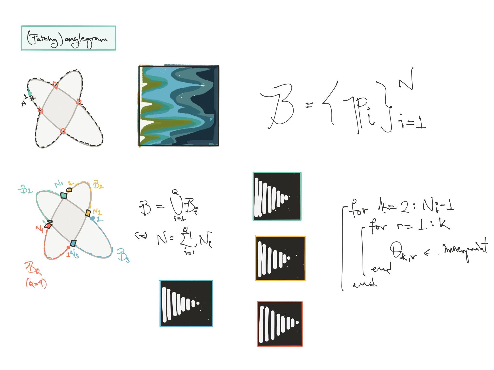

# Incomplete (patchy)anglegram analysis
This log follows the development of the script file
[scr_emptygramanalysis.m](../scr_emptygramanalysis.m)
that explores a variation of the anglegram for incomplete
object sections and try to relate them to basic shapes.
## Review of full anglegram and flow of _pag_

## Anglegram by segments
